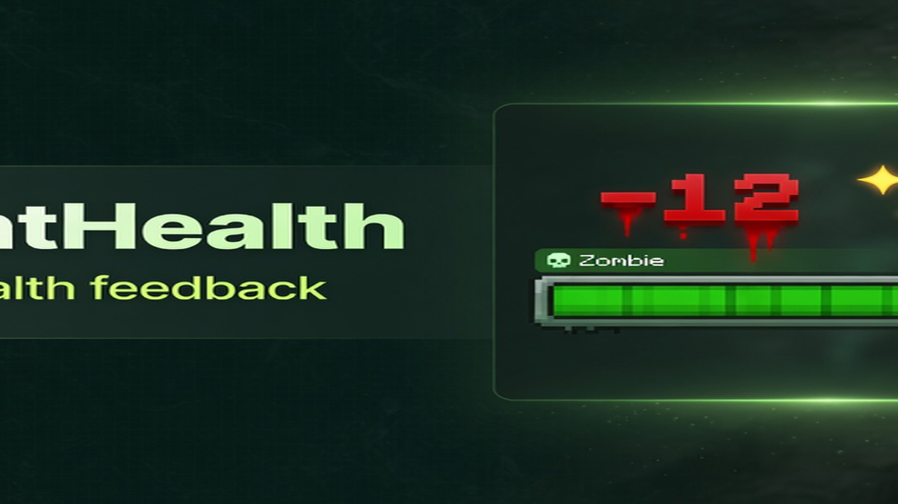
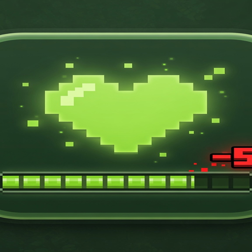

<p align="center">
  
</p>

<h1 align="center">LightHealth</h1>

<p align="center">
  <strong>Modern mob health feedback for Paper / Folia</strong><br>
  Hologram · damage numbers · actionbar · bossbar · look-at
</p>

<p align="center">
  <a href="https://dimasergeew.github.io/LightHealth/"></a>
  <a href="https://modrinth.com/plugin/lighthealth"></a>
  <a href="https://github.com/DimaSergeew/LightHealth/releases/latest"></a>
  <a href="LICENSE"></a>
</p>

<p align="center">
  <a href="https://dimasergeew.github.io/LightHealth/"><b>Documentation</b></a>
  ·
  <a href="https://modrinth.com/plugin/lighthealth">Modrinth</a>
  ·
  <a href="https://github.com/DimaSergeew/LightHealth/releases">Releases</a>
</p>

---

<p align="center">
  
</p>

**One job.** Show mob HP and damage — nothing else.  
Zero hard dependencies · Folia-ready · locales `en` `ru` `es` `zh`

| Channel | What you get |
|---------|----------------|
| **Hologram** | HP bar above the mob (TextDisplay, no name rewrite) |
| **Numbers** | Color tiers by damage · crits with ✦ |
| **Action / Boss** | Green → yellow → red with HP + damage |
| **Look-at** | Show HP while aiming at a mob |

<p align="center">
  
</p>

## Install

1. Drop the jar into `plugins/` and restart  
2. Hit a mob — or look at one  
3. Optional: edit `plugins/LightHealth/config.yml` → `/lh reload`

```yaml
language: en
style: bar
display:
  hologram: true
  damage-numbers: true
  actionbar: true
  bossbar: true
```

## Commands

| Command | Description |
|---------|-------------|
| `/lh toggle` | Personal on/off |
| `/lh reload` | Reload config (admin) |
| `/lh lang <en\|ru\|es\|zh>` | Set language (admin) |

Aliases: `/lighthealth` · `/mhp`

Full reference → **[Wiki](https://dimasergeew.github.io/LightHealth/)**

## Build

```bash
./gradlew build
# → build/libs/LightHealth-1.0.0.jar
```

**Requires** Java **25+** · Paper **1.21+ / 26.x** (or Folia)

## License

[MIT](LICENSE) · [bedepay](https://github.com/DimaSergeew)
