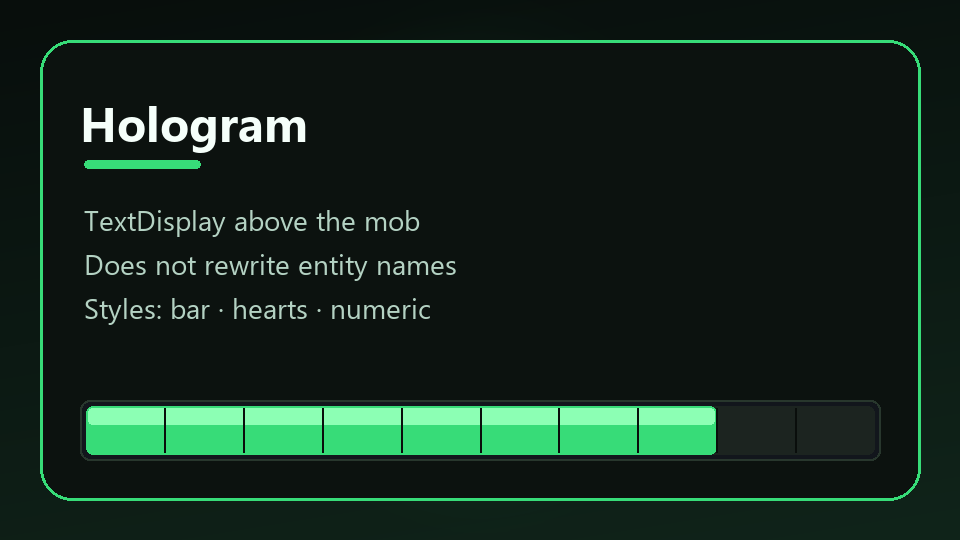
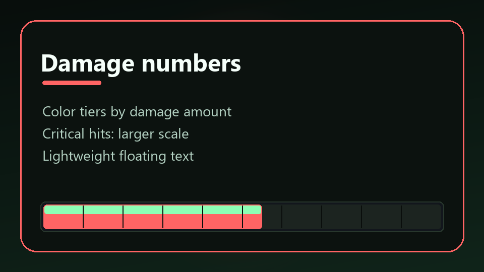
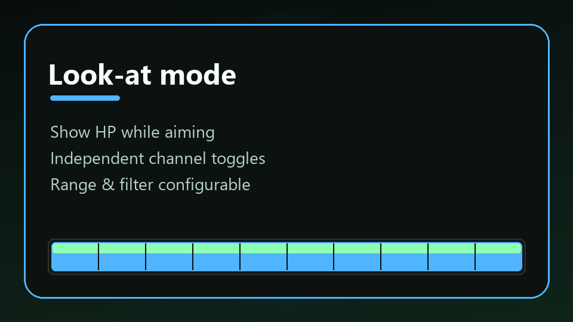

# LightHealth

<p align="center">
  
</p>

<p align="center">
  <strong>Modern mob health feedback for Paper / Folia</strong><br>
  Hologram · damage numbers · actionbar · bossbar · look-at
</p>

<p align="center">
  <a href="https://dimasergeew.github.io/LightHealth/"></a>
  <a href="https://modrinth.com/plugin/lighthealth"></a>
  <a href="https://github.com/DimaSergeew/LightHealth/releases/latest"></a>
  <a href="LICENSE"></a>
</p>

<p align="center">
  <a href="https://dimasergeew.github.io/LightHealth/"><b>Documentation</b></a>
  ·
  <a href="https://modrinth.com/plugin/lighthealth">Modrinth</a>
  ·
  <a href="https://github.com/DimaSergeew/LightHealth/releases">Releases</a>
</p>

---

**One job.** Show mob HP and damage — nothing else.  
Zero hard deps · Folia-ready · `en` `ru` `es` `zh`

<p align="center">
  
</p>

| Channel | What you get |
|---------|----------------|
| **Hologram** | Bar above mob (TextDisplay) |
| **Numbers** | Color tiers + crit ✦ |
| **Action / Boss** | Green → yellow → red |
| **Look-at** | HP while aiming |

<p align="center">
  
  
  
</p>

## Install

1. Drop jar into `plugins/` → restart  
2. Hit a mob (or look at one)  
3. Config: `plugins/LightHealth/config.yml` → `/lh reload`

```yaml
language: en
style: bar
display: { hologram: true, damage-numbers: true, actionbar: true, bossbar: true }
```

## Commands

| | |
|--|--|
| `/lh toggle` | Personal on/off |
| `/lh reload` | Reload (admin) |
| `/lh lang <en\|ru\|es\|zh>` | Language (admin) |

Aliases: `/lighthealth` · `/mhp`

Full reference → **[Wiki](https://dimasergeew.github.io/LightHealth/)**

## Build

```bash
./gradlew build
# build/libs/LightHealth-1.0.0.jar
```

Requires **Java 25+** · Paper **1.21+ / 26.x**

## License

[MIT](LICENSE)
