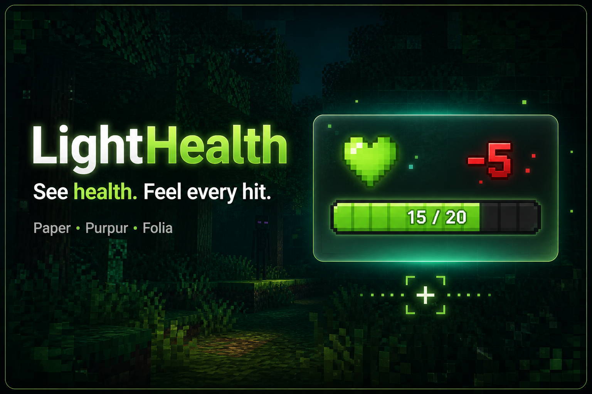

<p align="center">
  
</p>

<p align="center">
  <strong>Private, lightweight combat feedback for modern Minecraft servers.</strong><br>
  Inspect a mob before the fight. See every hit when combat begins.
</p>

<p align="center">
  <a href="https://github.com/DimaSergeew/LightHealth/releases/latest"></a>
  <a href="https://dimasergeew.github.io/LightHealth/"></a>
  <a href="https://www.spigotmc.org/resources/lighthealth.137519/"></a>
</p>

<p align="center">
  
  
  
  
  <a href="LICENSE"></a>
</p>

---

## Combat information without the clutter

LightHealth is a focused **mob health plugin and damage indicator** for Paper,
Purpur, and Folia. Aim at a mob to inspect its HP without attacking, then get
clear, responsive feedback as soon as combat starts.

Unlike nametag-based health plugins, LightHealth uses per-viewer `TextDisplay`
holograms. Mob names stay untouched, other players are not forced to see your UI,
and no dependencies or gameplay changes are added.

<table>
  <tr>
    <td width="33%" align="center">
      <strong>Inspect</strong><br>
      Aim at a mob to see its health before attacking.
    </td>
    <td width="33%" align="center">
      <strong>Fight</strong><br>
      Get holograms, damage numbers, and personal bars.
    </td>
    <td width="33%" align="center">
      <strong>Stay in control</strong><br>
      Use <code>/lh toggle</code> and <code>/lh status</code> at any time.
    </td>
  </tr>
</table>

<p align="center">
  
</p>

## Why LightHealth?

- **Private by design** — displays are shown per viewer and never rewrite mob nametags.
- **Four display channels** — holograms, floating numbers, action bar, and optional boss bar.
- **Look-at inspection** — configurable raycast feedback without dealing damage.
- **Flexible styles** — choose `bar`, `hearts`, `numeric`, or a custom MiniMessage format.
- **Ready for modern servers** — Paper, Purpur, and Folia with no hard dependencies.
- **Four bundled locales** — English, Russian, Spanish, and Chinese.

## Get started

1. Download the latest jar from **[GitHub Releases](https://github.com/DimaSergeew/LightHealth/releases/latest)**.
2. Move it into your server's `plugins/` folder.
3. Restart the server, then look at or hit a mob.

<details>
<summary><strong>Default configuration</strong></summary>

<br>

```yaml
language: en
style: bar
display:
  hologram: true
  damage-numbers: true
  actionbar: true
  bossbar: false
```

</details>

Configure look-at, display timing, damage tiers, styles, and custom formats in the
**[configuration guide](https://dimasergeew.github.io/LightHealth/config/)**.

## Commands

Aliases: `/lh`, `/lighthealth`, `/mhp`.

| Command | Permission | Description |
|---------|------------|-------------|
| `/lh` | — | Show help |
| `/lh toggle` | `lighthealth.toggle` | Turn personal feedback on or off |
| `/lh status` | — | Show personal setting, active channels, look-at, and style |
| `/lh reload` | `lighthealth.admin` | Reload config and messages |
| `/lh lang <en\|ru\|es\|zh>` | `lighthealth.admin` | Set the plugin language |

Full reference: **[commands & permissions](https://dimasergeew.github.io/LightHealth/commands/)**.

## Permissions

| Permission | Default | Description |
|------------|---------|-------------|
| `lighthealth.see` | `true` | See health displays (bars, holograms, numbers, look-at) |
| `lighthealth.toggle` | `true` | Use `/lh toggle` |
| `lighthealth.admin` | `op` | Reload and language |

## Requirements

| | |
|--|--|
| Server | Paper, Purpur, or Folia **1.21.4+** (Paper **26.x** included) |
| Java | **21+** on 1.21.x · **25+** on 26.x (Minecraft itself requires 25) |
| Dependencies | None |

This is a Paper plugin. It will not load on CraftBukkit or Spigot.

## Build

You need **JDK 25** to compile (Paper 26.2 API). The published jar is Java 21 bytecode.

```bash
./gradlew build
# → build/libs/LightHealth-1.1.0.jar
```

## License

[MIT](LICENSE) · [bedepay](https://github.com/DimaSergeew)
