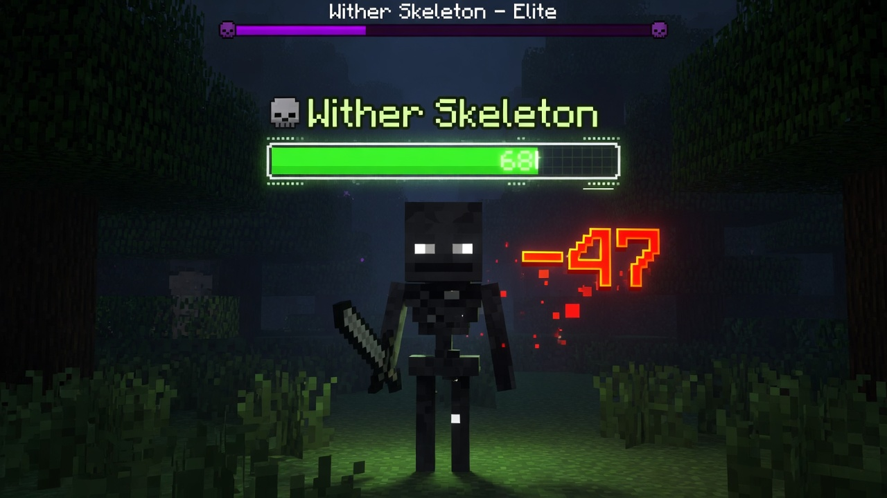

---
hide:
  - toc
---

# LightHealth

{ .hero }

Show mob health and damage on <strong>Paper</strong>, <strong>Purpur</strong>, and <strong>Folia</strong> — clearly, and nothing else.

[Install the plugin](install.md){ .md-button .md-button--primary }
[Browse the config](config.md){ .md-button }
[Latest release](https://github.com/DimaSergeew/LightHealth/releases/latest){ .md-button }

## What you get

-   :material-card-text-outline:{ .lg .middle } **Hologram**

    ---

    A health bar above the mob, drawn as a `TextDisplay`. Mob names stay untouched.

-   :material-numeric-9-plus-box-outline:{ .lg .middle } **Damage numbers**

    ---

    Floating amounts, colored by how hard you hit, with a distinct crit look.

-   :material-rectangle-outline:{ .lg .middle } **Action / boss bar**

    ---

    Personal health and damage feedback, shifting green → yellow → red.

-   :material-eye-outline:{ .lg .middle } **Look-at**

    ---

    The same feedback while you aim at a mob — no hit required.

{ .hero }

## Why it stays small

-   **One job** — health and damage only. No extra gameplay.

-   **No dependencies** — drop the jar in and restart.

-   **Paper family** — Paper, Purpur, and Folia (1.21+ / 26.x).

-   **Four locales** — `en` · `ru` · `es` · `zh`.

## Next steps

-   [:material-download: Install](install.md)

    Requirements, first run, and building from source.

-   [:material-console: Commands](commands.md)

    Toggle, reload, language, and permissions.

-   [:material-cog: Config](config.md)

    Styles, channels, formats, and blacklists.

-   [:material-frequently-asked-questions: FAQ](faq.md)

    Common setup questions and Folia notes.

